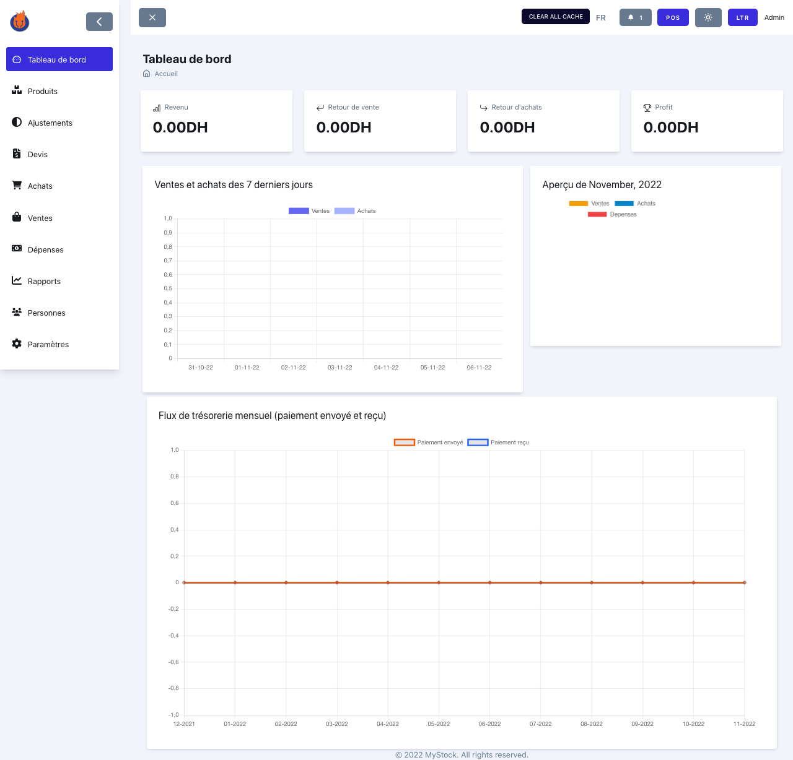
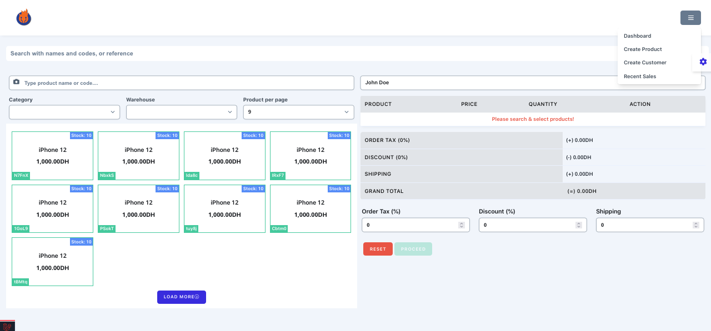
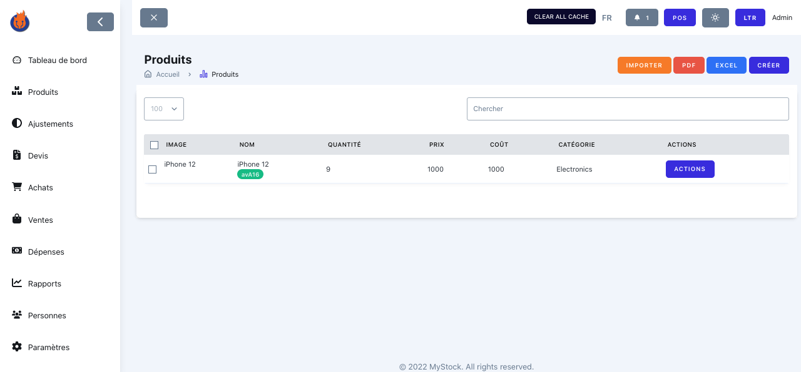
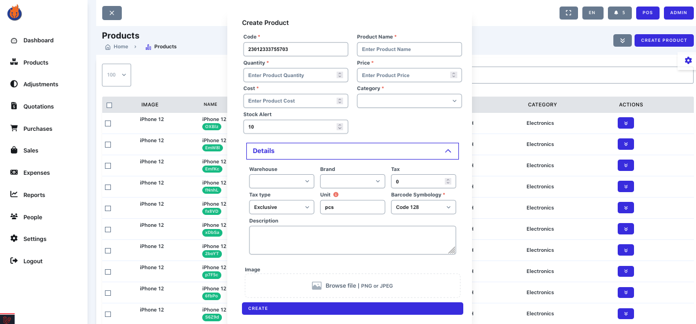
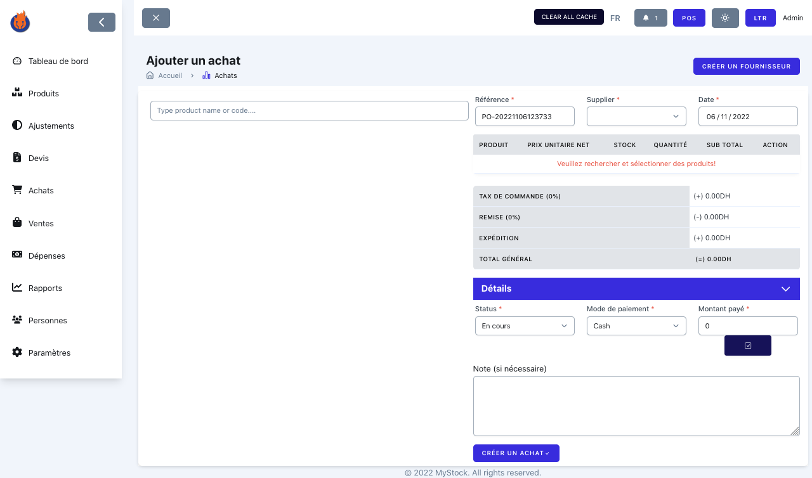
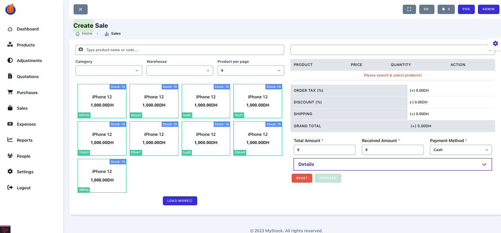
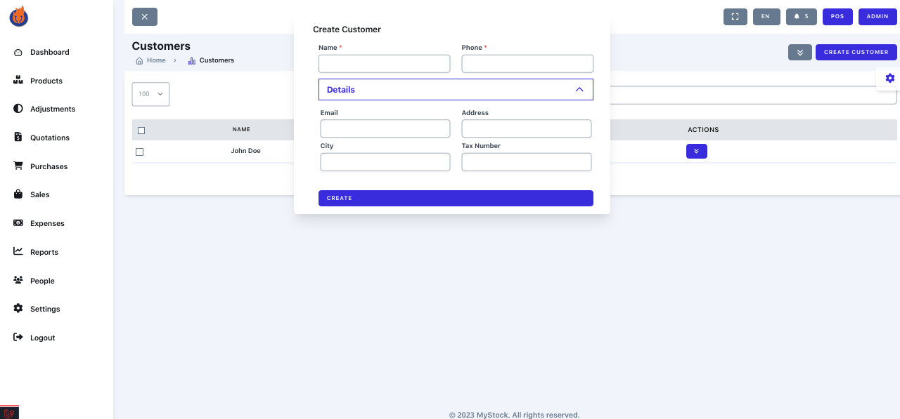

## Author 

Welcome to a unique project that goes beyond the ordinary. I bring to you MystockMaster, a solution born out of my experience in the retail and ecommerce sectors, particularly in electronics such as PCs and smartphones. My continuous vigilance over critical aspects like user-friendliness and robustness aims to position us as the best in the open-source web apps category.

I extend heartfelt gratitude to the Laravel community for their contributions, which have been a source of immense learning. Now, it's my turn to contribute and give back.

(✌) سلام

## Overview 

MystockMaster is a powerful, Laravel-based inventory management system designed to streamline operations for businesses of all sizes, particularly those in retail and e-commerce sectors dealing with electronics like PCs and smartphones. It simplifies the complexities of tracking inventory, sales, and purchases, empowering you to make data-driven decisions and optimize your business growth.

**Key Benefits:**

*   **Effortless Inventory Tracking:**  Easily monitor stock levels across multiple warehouses, preventing stockouts and overstocking.
*   **Simplified Sales and Purchase Management:**  Keep accurate records of all sales and purchase transactions, providing a clear financial overview.
*   **Data-Driven Insights:**  Utilize the user-friendly dashboard and intuitive reports to gain valuable insights into your business performance.
*   **Enhanced Efficiency:**  Automate key inventory management tasks, freeing up your time to focus on strategic initiatives.

Offering a user-friendly dashboard, intuitive reports, and an array of features, it becomes your partner in efficient business management and growth.

## Features:

- **Dashboard with key insights and metrics:**  Provides a centralized view of your business performance with key metrics like total sales, stock levels, and recent activity.
- **Products, categories, brands, and suppliers management:**  Organize your product catalog with detailed information, including categories, brands, and supplier details.
- **Sales and purchases tracking:**  Record and manage all sales and purchase orders, including customer and supplier information.
- **Customers and user management with roles and permissions:**  Manage customer information and control user access with customizable roles and permissions.
- **Settings and preferences:**  Configure the system to match your specific business needs, including currency settings and notification preferences.
- **Inventory adjustment and stock management:**  Easily adjust stock levels, track stock movements, and manage inventory across multiple locations.
- **Multi-currency support:**  Transact in multiple currencies, ideal for businesses with international operations.
- **Warehouses multi-locations:**  Manage inventory across multiple physical warehouse locations.
- **Local and cloud-based backup options:**  Secure your data with flexible backup options.
- **Import/Export functionality:**  Import and export data in various formats for seamless integration with other systems.
- **Multi-language support:**  Use the application in your preferred language.
- **POS integration:**  Integrate with Point of Sale (POS) systems for streamlined sales transactions.
- **Notifications and alerts:**  Receive timely notifications about low stock levels, order updates, and other important events.
- **Send product promotions to Telegram:**  Engage with your customers directly by sending promotional messages via Telegram.


## Demo

You can check the demo here: 
[https://test.hotechserver.com](https://test.hotechserver.com)


## Login with the following credentials
    -   Email: `admin@gmail.com`
    -   Password: `password`

## Requirements

-   PHP >= 8.0 (or higher)
-   Composer
-   Node.js
-   NPM
-   MySQL

## Installation

1. **Clone the repository:** Obtain the project files by cloning the repository to your local machine using Git:
   ```bash
   git clone <https://github.com/Zakarialabib/myStockMaster.git>
   cd mystockmaster
   ```
2. **Install PHP Dependencies:** Navigate to the project directory and install the required PHP packages using Composer:
   ```bash
   composer install
   ```
3. **Install Node.js Dependencies:** Install the necessary JavaScript packages using npm:
   ```bash
   npm install
   ```
4. **Compile Assets:** Compile the application's assets (CSS and JavaScript) using Laravel Mix:
   ```bash
   npm run build
   ```
5. **Configure Database:**
   *   Create a new MySQL database for MystockMaster.
   *   Copy the `.env.example` file to `.env` and update the database connection details (DB_DATABASE, DB_USERNAME, DB_PASSWORD) to match your database configuration.
6. **Run Database Migrations and Seeders:** Set up the database tables and seed initial data:
   ```bash
   php artisan migrate --seed
   ```
7. **Login:** Access the application in your web browser, and log in with the following credentials:
    - Email: `admin@gmail.com`
    - Password: `password`
8. **Enjoy!** You are now ready to start using MystockMaster to manage your inventory.

## License

The Laravel framework is open-sourced software licensed under the [MIT license](https://opensource.org/licenses/MIT).

## Screenshots : 

| Login | Dashboard | POS |
| --- | --- | --- |
|  |  |  |

| Products | Product Create | Purchase Create |
| --- | --- | --- |
|  |  |  |

| Sale Create | Customer Create |
| --- | --- |
|  |  |

## Contact

-   [Twitter](https://twitter.com/zakarialabib)
-   [LinkedIn](https://www.linkedin.com/in/zakaria-labib/)
-   [GitHub](https://www.github.com/zakarialabib/)

## Donate

If you like this project, leave a star and share it with your friends.

## Credits

-   [Laravel](https://laravel.com/)
-   [Tailwind CSS](https://tailwindcss.com/)
-   [Livewire](https://laravel-livewire.com/)
-   [AlpineJs](https://alpinejs.dev/)

### Want to Contribute?

We welcome contributions of all kinds! Here's how you can help:

- 🐛 Report bugs and issues
- 💡 Suggest new features
- 📖 Improve documentation
- 🔧 Submit pull requests

## Contributors

| Contributor | GitHub Profile |
| --- | --- |
| [Zakarialabib](https://github.com/Zakarialabib) | [](https://github.com/Zakarialabib) |
| [elmarzouguidev](https://github.com/elmarzouguidev) | [](https://github.com/elmarzouguidev) |
| [bilton30](https://github.com/bilton30) | [](https://github.com/bilton30) |
| [ismaail](https://github.com/ismaail) | [](https://github.com/ismaail) |
| [yassinebenaid](https://github.com/yassinebenaid) | [](https://github.com/yassinebenaid) |
| [slaweallx](https://github.com/slaweallx) | [](https://github.com/slaweallx) |
| [fabyo0](https://github.com/fabyo0) | [](https://github.com/fabyo0) |
| [hidjrahs](https://github.com/hidjrahs) | [](https://github.com/hidjrahs) |
| [josecarpio99](https://github.com/josecarpio99) | [](https://github.com/josecarpio99) |


