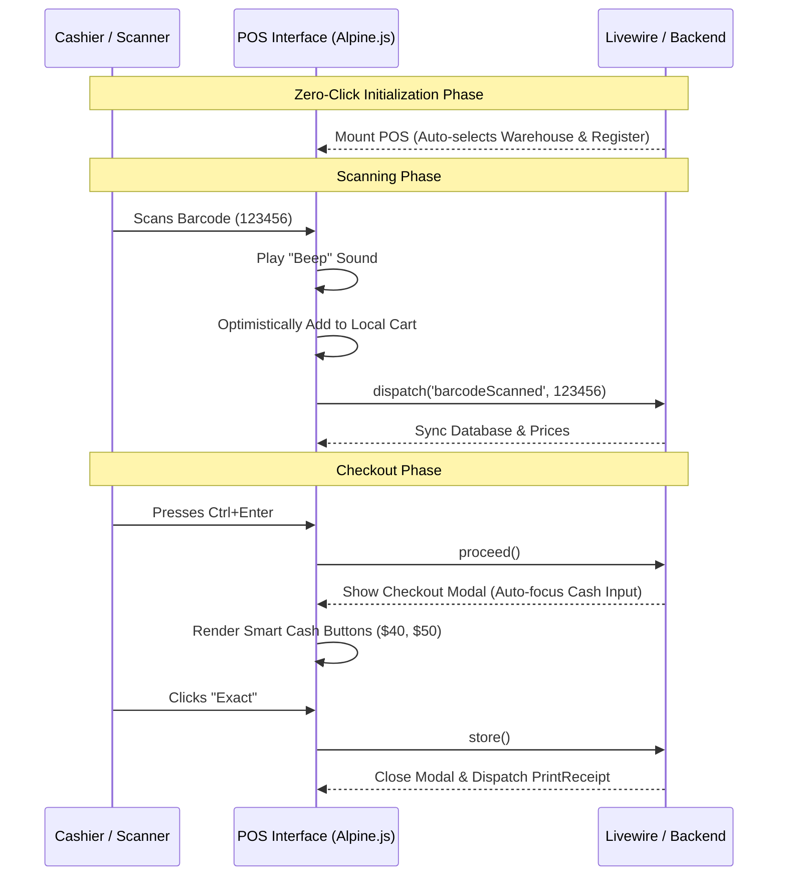

# Comprehensive UX/CX Orchestration Strategy: POS Optimization

This document outlines the UX (User Experience) and CX (Customer Experience) orchestration strategy for the myStockMaster application, prioritizing the **Point of Sale (POS) and Checkout journey**.

## 1. Detailed Audit of Existing Ecosystem

### Data Models & Architecture
- **Core Models**: `Product`, `Warehouse`, `Customer`, `Sale`, `SaleDetails`, `SalePayment`, `CashRegister`.
- **State Management**: The POS relies heavily on Livewire v4 for backend state (`$cartContent`, `$total_amount`) and Alpine.js for frontend reactivity (local calculations of `$grandTotal`, `$cartTax`).
- **Relationships**: A Sale requires a `Warehouse` (source of stock), a `Customer` (destination), and an open `CashRegister` (financial tracking).

### Interface Patterns
- **Layout**: A functional 3-column flex layout (40% Products, 35% Cart, 25% Actions).
- **Hardware Integration**: Global window listener captures keystrokes with <50ms intervals to detect and dispatch `barcodeScanned` events.
- **Modals**: Checkout and Cash Register initialization are handled via full-screen overlay modals.

---

## 2. Identification of Friction Points

Our analysis of `app/Livewire/Pos/Index.php` and its associated Blade views revealed the following friction points that interrupt the cashier's "flow state":

1. **Blocking Prerequisites**: The UI grays out and blocks product scanning until a `Warehouse` is manually selected. If no `CashRegister` is open, the user is abruptly forced into a creation modal.
2. **Cart Interaction Lag**: Cart quantities and prices use `wire:model.blur`. Cashiers must click away from the input to sync state with the server. There are no touch-friendly `+` and `-` stepper buttons for rapid adjustments.
3. **Customer Selection Scaling**: The customer list uses a native HTML `<select>` dropdown. For stores with thousands of customers, this is unsearchable and severely slows down checkout.
4. **State Desynchronization Risk**: Because Alpine calculates the grand total locally but the backend relies on the Livewire `$total_amount` property, rapidly pressing `Ctrl+Enter` (Checkout) after typing a quantity can use stale server-side totals.
5. **Static Payment Buttons**: The quick cash buttons in the checkout modal are hardcoded (`+10`, `+50`, `+100`). These do not dynamically adapt to common currency denominations based on the actual cart total.

---

## 3. Optimized Orchestration Patterns

To maximize interactions and minimize friction, we will implement the following orchestration patterns:

### Navigation & Layout
- **Fluid & Collapsible**: Maintain the 3-column layout on desktops but introduce a collapsible right-hand panel (Actions/Customer) to maximize cart visibility on tablets.

### Interaction Sequences
- **Zero-Click Initialization**: Auto-assign the user's default warehouse. If the user doesn't have an open cash register, silently open one in the background (or prompt non-intrusively via a toast rather than a blocking modal).
- **Touch-Optimized Cart**: Add intuitive `+` and `-` stepper buttons to cart rows that immediately dispatch a debounced state sync (`wire:model.live.debounce.300ms`).
- **Combobox Search**: Replace the native customer `<select>` with a searchable, Alpine-powered Combobox (dropdown with text search) that lazy-loads customers.
- **Dynamic Cash Suggestions**: Implement smart cash buttons. If the total is $34, the buttons should automatically suggest `$35`, `$40`, `$50`, and `Exact`.

### Feedback Mechanisms
- **Audio Cues**: Play a short, subtle `beep.mp3` on successful barcode scan, and a `buzz.mp3` on "Product Not Found" or "Out of Stock".
- **Optimistic UI**: Immediately render scanned items in the Alpine cart state while Livewire syncs the database in the background.

---

## 4. Measurable Success Metrics

To validate the orchestration strategy, we will track the following KPIs:

1. **Time-to-Checkout (TTC)**: Average duration from the first barcode scan to the receipt printing. 
   - *Target*: < 12 seconds per transaction.
2. **Scan-to-Cart Latency**: The delay between the barcode scanner firing and the UI updating.
   - *Target*: < 100ms (achieved via Alpine optimistic updates).
3. **Interaction Clicks/Taps**: Number of manual clicks required to complete a cash sale for a walk-in customer.
   - *Target*: 2 interactions (Scan -> Press `Ctrl+Enter` -> Click `Exact Cash / Complete`).
4. **Error Rate**: Frequency of validation errors (e.g., "Please select warehouse").
   - *Target*: < 1% of total transactions.

---

## 5. Flow Diagrams

The following sequence diagram illustrates the optimized, frictionless POS orchestration:

---

## 6. Technical Implementation Requirements

### Frontend (Livewire 4 + Alpine.js)
- **Audio API**: Bind an HTML5 `<audio>` element to Alpine state, triggered by `$watch` on cart additions or error events.
- **Debounced Sync**: Refactor `product-cart.blade.php` to replace `wire:model.blur` with `wire:model.live.debounce.300ms` on quantity inputs. Add `<button x-on:click="quantity++">` elements.
- **Smart Buttons Component**: Create an Alpine component inside the checkout modal that calculates the next highest logical currency denominations (e.g., rounding up to the nearest 5, 10, or 20) based on `$wire.total_amount`.

### Backend (Laravel 12)
- **Lazy Loading**: Implement a dedicated `CustomerSearch` Livewire component or API endpoint to feed the new Customer Combobox, preventing the hydration of thousands of customers on mount.
- **Silent Register Opening**: Update `Pos\Index::mount()` to automatically create a `CashRegister` record if the user is authorized, bypassing the `CashRegisterCreate` modal interruption.

---

## 7. Testing Protocols

1. **Automated Feature Tests**: 
   - Write strict Pest/PHPUnit tests verifying that `barcodeScanned` accurately retrieves items and updates the cart without requiring warehouse selection explicitly (if default is set).
2. **UX Lab Testing (Shadowing)**:
   - Provide a cashier with a barcode scanner and 10 physical items.
   - Measure TTC (Time-to-Checkout) and observe screen interactions. If the cashier uses the mouse more than twice, the test fails.
3. **Performance Profiling**:
   - Utilize Laravel Telescope to monitor the POS payload size. The transition to a Customer Combobox should drop the initial payload size by >50% for large databases.

---

## 8. Rollout Plan & A/B Testing

To ensure the new orchestration strategy yields positive results without disrupting ongoing operations:

- **Phase 1: Alpha Testing (Internal)**
  - Deploy to a staging environment. Run synthetic load tests simulating rapid barcode scanning (5 scans per second) to verify Livewire debouncing stability.
- **Phase 2: A/B Testing Framework (Live)**
  - Implement a feature flag (`config('features.new_pos_ux')`).
  - **Group A (Control)**: 50% of cashiers receive the legacy blur-based, modal-heavy POS.
  - **Group B (Variant)**: 50% of cashiers receive the optimized, zero-click POS.
  - **Data Collection**: Track TTC and Error Rates over 14 days using custom telemetry events.
- **Phase 3: General Availability (GA)**
  - Upon achieving the target metrics (e.g., TTC < 12s), roll out the interface globally.
  - Deprecate the legacy POS views and release training documentation highlighting the new keyboard shortcuts and smart buttons.