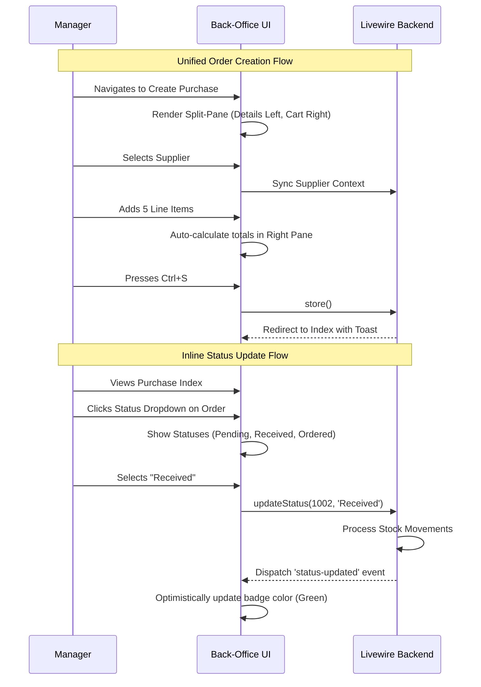

# Comprehensive UX/CX Orchestration Strategy: Order Management Optimization

This document outlines the UX (User Experience) and CX (Customer Experience) orchestration strategy for the myStockMaster application, specifically focusing on the **Order Management journey** (Sales, Purchases, Quotations, and Returns).

## 1. Detailed Audit of Existing Ecosystem

### Data Models & Architecture
- **Core Models**: `Sale`, `Purchase`, `Quotation`, `SaleReturn`, `PurchaseReturn`.
- **Ancillary Models**: `Supplier`, `Customer`, `SaleDetails`, `PurchaseDetail`.
- **State Management**: Form state is managed via Livewire component properties (`$date`, `$warehouse_id`, `$supplier_id`, `$customer_id`, etc.). The cart functionality is shared with the POS via `LivewireCartTrait`.
- **Relationships**: Order models heavily rely on morph-many relationships (like `Movements` and `Payments`) to orchestrate financial and physical inventory changes.

### Interface Patterns
- **Layout**: Standard back-office layout (`layouts.app`) featuring a breadcrumb header and a top selection bar (e.g., selecting a warehouse first).
- **Cart Interaction**: Order creation uses an "Add to Cart" workflow. The cart is often hidden or separated (e.g., in `Sales/Create`, the cart is behind an `isCartOpen` Alpine boolean toggle).
- **Listing & Filtering**: Index pages (e.g., `Sales/Index`) utilize the `Datatable` trait for server-side pagination, sorting, and searching.

---

## 2. Identification of Friction Points

Our analysis of the Order Management flows (`app/Livewire/Sales`, `app/Livewire/Purchase`, etc.) reveals several friction points that impact back-office efficiency:

1. **Disconnected Cart Workflow**: In `Sales/Create.php` and `Purchase/Create.php`, the cart is partially hidden or requires modal toggles (`isCartOpen = true`) to view the checkout. This disconnects the product selection from the financial summary.
2. **Synchronous Data Entry**: Creating a Sale or Purchase requires sequentially filling out dropdowns (Warehouse, Customer/Supplier). If a supplier or customer is missing, the user must open a modal, create it, wait for the refresh, and then re-select it.
3. **Heavy Index Queries**: The `Datatable` implementations on `Sales/Index` and `Purchases/Index` load large datasets with eager-loaded relationships (`user`, `customer`, `payments`). Without cursor pagination or deferred loading, these pages become sluggish as the database grows.
4. **Status Management Friction**: Changing an order status (e.g., from "Pending" to "Completed", or updating Payment Status) often requires editing the entire order rather than utilizing quick-action toggles directly from the index view.
5. **Redundant Form State**: The `Create` components declare massive amounts of public properties (`$global_discount`, `$tax`, `$shipping_amount`, `$note`) which are manually synced, increasing the risk of validation errors or lost state on hydration.

---

## 3. Optimized Orchestration Patterns

To streamline back-office operations and reduce cognitive load for managers and accountants, we propose the following orchestration patterns:

### Navigation & Layout
- **Unified Split-Pane Order Entry**: Replace the modal-based checkout in `Create` views with a split-pane layout (similar to a CRM). The left pane contains the document details (Customer, Date, Reference) and product search. The right pane persistently displays the order summary and line items.
- **Contextual Slide-Overs**: Instead of navigating away or using disruptive modals, use slide-over panels (off-canvas menus) for creating related entities (e.g., "Add New Supplier") without losing the context of the current purchase order.

### Interaction Sequences
- **Inline Status Updates**: Introduce Alpine-powered dropdowns directly on the `Index` datatables allowing users to change `sale_status` or `payment_status` via a single click (triggering a lightweight Livewire method like `updateStatus($id, $status)`).
- **Keyboard Navigation**: Implement global hotkeys (`Ctrl+S` to save order, `Alt+N` for new line item) to accelerate data entry for power users.
- **Document Duplication**: Add a "Duplicate to Order" action. A user can click a Quotation and immediately generate a Draft Sale without re-entering any line items.

### Feedback Mechanisms
- **Draft Auto-Saving**: Implement `#[Computed]` background syncing or local storage caching for order drafts so that if a browser crashes, the complex purchase order is not lost.
- **Timeline/History Log**: Introduce an activity timeline component on the `Show`/`Edit` pages, detailing exactly who created the order, when payments were added, and when stock was dispatched.

---

## 4. Measurable Success Metrics

To validate the orchestration improvements in Order Management, we will track:

1. **Order Creation Time**: Average duration from clicking "Create Sale/Purchase" to successful submission.
   - *Target*: 30% reduction in time spent per order.
2. **Status Update Latency**: The number of clicks required to mark a pending order as paid/shipped.
   - *Target*: Reduction from ~4 clicks (Edit -> Change -> Save) to 2 clicks (Dropdown -> Select).
3. **Index Page Load Time (TTFB)**: Time to first byte for `Sales/Index` and `Purchases/Index`.
   - *Target*: < 200ms, regardless of database size (via optimized datatable queries).
4. **Draft Abandonment Rate**: Percentage of initiated orders that are never saved.
   - *Target*: Decrease by 15% via auto-save and split-pane visibility.

---

## 5. Flow Diagrams

The following sequence illustrates the optimized "Inline Status Update" and "Unified Split-Pane" orchestration:

---

## 6. Technical Implementation Requirements

### Frontend (Livewire 4 + Alpine.js)
- **Split-Pane Layout**: Create a new Blade component `<x-layout.split-pane>` utilizing CSS Grid/Flexbox to keep the order summary sticky on the right side while the left side scrolls.
- **Inline Edit Dropdowns**: Create an Alpine component `<x-table.status-dropdown>` that emits a Livewire event upon selection, showing a loading spinner while the backend processes the state change.
- **Hotkeys**: Register window-level Alpine event listeners (`@keydown.window.ctrl.s.prevent`) mapped to `$wire.store()`.

### Backend (Laravel 12)
- **Status Update Actions**: Create dedicated Action classes (e.g., `UpdatePurchaseStatusAction`) to ensure that changing a status from an Index page correctly triggers side effects (like creating `Movement` records when a purchase is marked "Received").
- **Draft State**: Utilize `Cache::put()` tied to the authenticated user's session to temporarily store `$cartContent` for back-office orders, distinct from the POS cart.

---

## 7. Testing Protocols

1. **Automated Integration Tests**: 
   - Write tests ensuring that inline status updates correctly trigger inventory movements (e.g., changing Purchase status to 'Completed' increases stock).
2. **Session Persistence Testing**:
   - Simulate a browser refresh mid-order creation to ensure the Draft Auto-Saving mechanism correctly restores line items and supplier context.
3. **UX Validation (Task Timing)**:
   - Time an administrator creating a 10-item purchase order using the old modal-based workflow vs. the new split-pane keyboard-navigable workflow.

---

## 8. Rollout Plan & A/B Testing

- **Phase 1: Component Refactoring (Non-Breaking)**
  - Implement the inline status dropdowns on `Sales/Index` and `Purchases/Index`. This provides immediate value with minimal risk.
- **Phase 2: Split-Pane Beta**
  - Release the split-pane `Create` and `Edit` views alongside the legacy views (e.g., via a toggle "Try the new Order Editor").
  - Gather telemetry on Order Creation Time and gather qualitative feedback from back-office staff.
- **Phase 3: Action Standardization**
  - Ensure all status updates (whether from the new inline dropdowns or the edit form) route through the same unified `Action` classes to guarantee data integrity.
- **Phase 4: Full Cutover**
  - Make the split-pane the default interface and remove legacy modal-based cart views from the back-office routes.